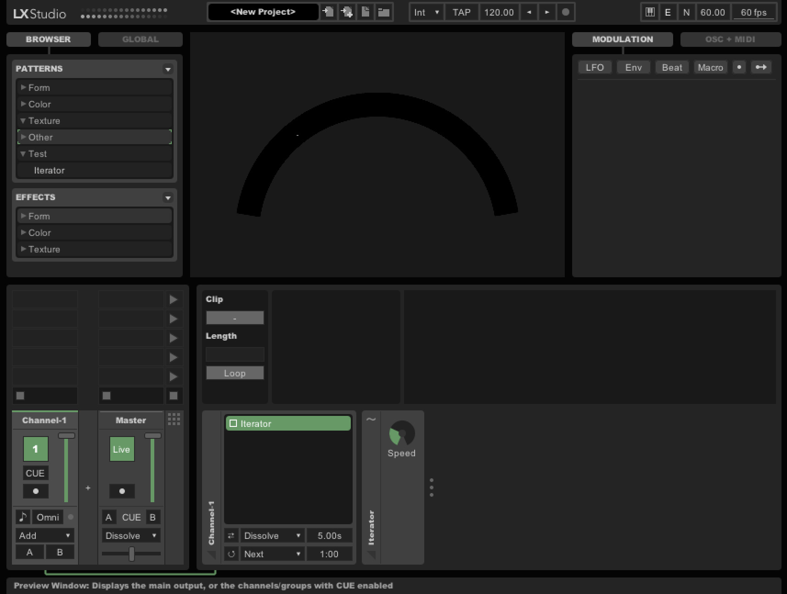
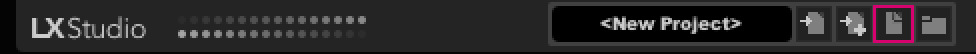
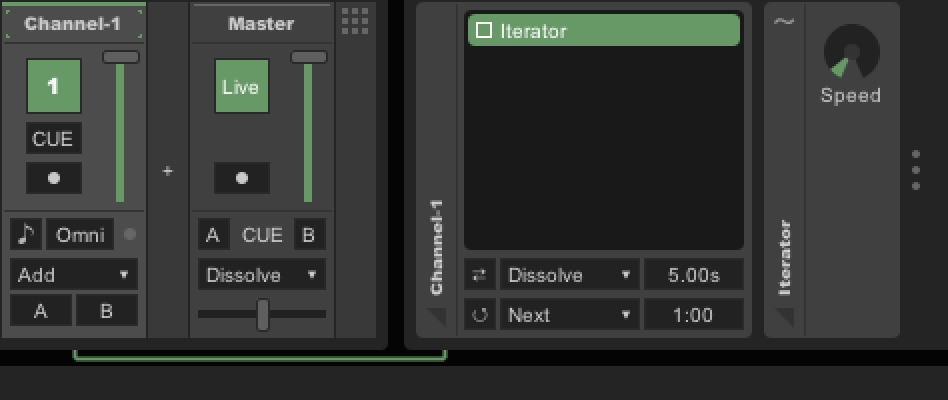
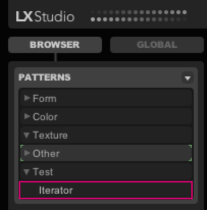
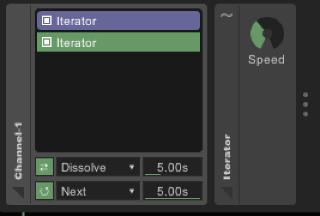
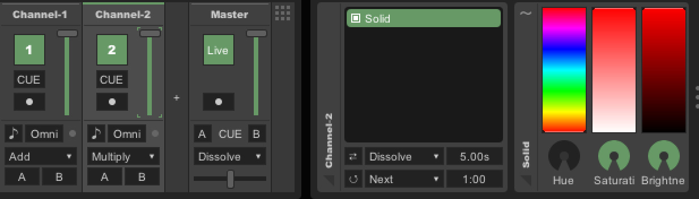
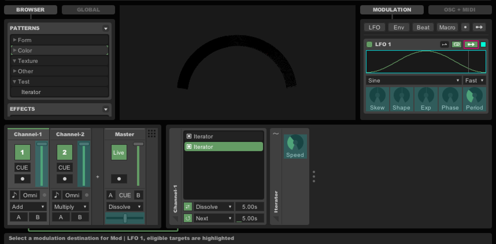
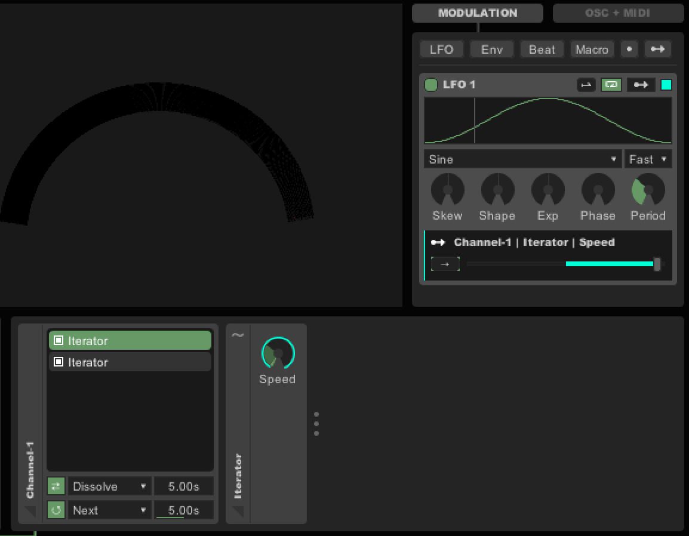
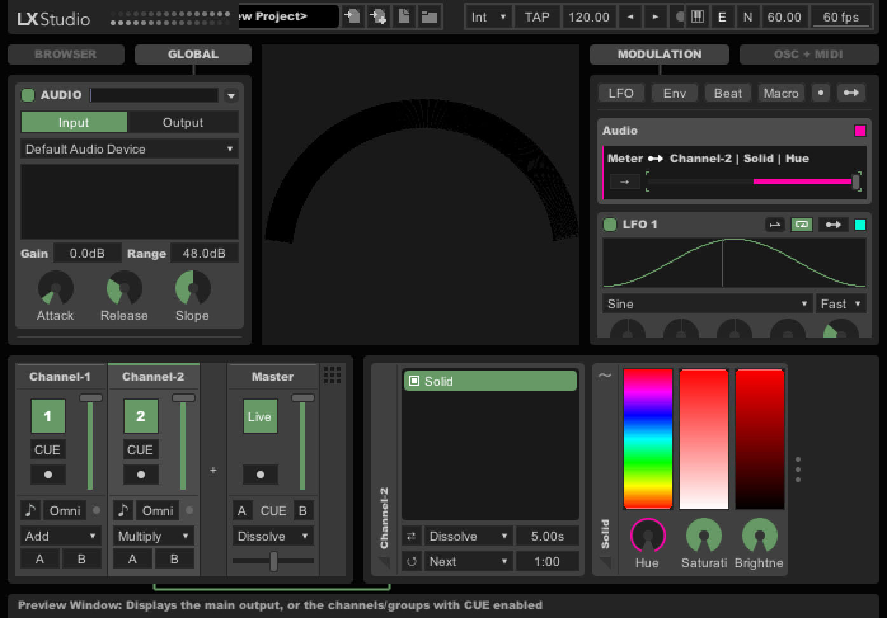

LX Studio User Guide
====================

LX Studio is a digital lighting workstation, bringing concepts from digital audio workstations and modular synthesis into the realm of LED lighting control. Generative patterns, interactive inputs, and flexible parameter-driven modulation — a rich environment for lighting composition and performance.

UI Basics
---------
Most input types have similar methods of data entry.  For text fields, you can click to select them and then press 'Enter' to enter editing mode.  For example,
you can use this to change channel names.  Knob values can be changed by a click-and-drag.  Drag up for increasing the value.  Drag down for decreasing the value.
You can also slick to select the knob, type a number, and then press Enter if you want to set an exact value.

Clicking and dragging in the Preview Window will rotate around your model.  Command-click-drag will allow you to pan the scene around (like a hand icon in other
3D programs).  The mouse wheel is for zooming in and out.

New Project
-----------

Open LX Studio with empty file or select 'New Project' icon in top toolbar.  LX Studio will initialize with a single pattern called Iterator that iterates through your points, lighting up each point in sequence.  When creating a new project, LX Studio will create a single channel titled 'Channel-1' that contains the Iterator pattern.  A channel contains a list of patterns and has one active pattern running.  

Channel Details Component
-------------------------

Select 'Channel-1' by clicking on 'Channel-1'.  You should see the Channel Details component on the bottom right of the window.
The Channel Details component allows you to schedule a pattern to become the currently running pattern.  Double-clicking a
pattern name will make it the currently running pattern.  On the bottom left of the Channel Details component is a circular
arrow toggle.  Enabling the toggle puts the Channel into Auto-Cycle.  In Auto-Cycle, the channel will play through the list
of patterns.  The amount of time spent on a pattern can be specified by entering a time into the Cycle-Time input box located
immediately to the right of the Auto-Cycle Mode combo box that defaults to 'Next'.  To enter a value, click to focus the
input box (it should now have green corner highlights).  Type a number of seconds, such as 30, and then press enter.  The value
can also be changed via a click-and-drag.  To increase the value, click-and-drag up.  To decrease the value, click-and-drag down.
For a random shuffle of patterns, change the Auto-Cycle Mode dropdown combobox from 'Next' to 'Random'.  For live performance
situations, you want to avoid hard transitions betweens patterns.  To enable Transitions, select the Transitions toggle, just
above the Auto-Cycle toggle.  Now, if you double click a pattern to make it active, the new pattern will be highlighted purple
while the transition between patterns is taking place.  The type of transition can be selected via the Transition Blend dropdown
combobox immediately to the right of the Transition toggle.  The default is 'Dissolve'.  The length of time of the transition
can also be specified in the input box immediately to the right of the Transition Blend combobox.

Pattern Details Component
-------------------------
When you have selected a pattern, the Pattern Details component will be visible immediately to the right of the Channel Details
component, labeled with the pattern name.  The Pattern Details component allow you to configure pattern parameters.  For Iterator,
we can adjust the speed of the iteration.  The value in the speed knob can be increased or decreased by click-and-drag up or
click-and-drag down.  The value can also be set exactly by clicking the knob to select it and then typing a value and then pressing
enter.

Adding a Pattern to a Channel
-----------------------------

In order to try out Auto-Cycle and Transitions, you will need multiple patterns in your channel.  You can add a Pattern to a Channel
via the Pattern Browser.  Click on 'Browser' in the top left of the window.  You should see a list of patterns.  Since patterns
are model-specific, there are only a few test patterns.  Click 'Channel-1' to select it.  And then double-click 'Iterator' to add
a second Iterator pattern to your channel.

In this example, I have two iterators with Auto-Cycle and Transitions enabled.  The pattern play time is 5 seconds and the transition
is 5 seconds.  Also, in order for a pattern to play in Auto-Cycle mode the toggle before the pattern name should be ON as in the
image above.  You can also see that the first Iterator is highlighted in purple, meaning that a transition is taking place.

Multiple Channels
-----------------

LX Studio supports multiple channels.  Each channel is assigned to a channel bus.  By default, the channel will be combined with the
main channel bus.  LX Studio also supports a Cross-fader Group A channel bus and a Cross-fader Group B channel bus.  For a given
channel bus, the output of each channel is blended into the channel bus (from left to right).  To add a Channel, click on the '+'
between the 'Channel-1' channel and the 'Master' channel.  You should now have a 'Channel-2' channel with an Iterator in it.  Click to
select 'Channel-2' if it is not already selected and then double-click the 'Solid' pattern in the Pattern Browser to add it to 'Channel-2'.
Patterns are organized by function.  'Solid' is in the Color category, so you might need to expand the 'Color' category in the Pattern Browser
in order to find it.  Make sure 'Solid' is the active pattern in 'Channel-2'.  Note, you can delete the default Iterator pattern by
clicking on it to select it and then pressing 'delete' (ctrl-backspace on Windows).  Set the Blend Mode to Multiply (located in the
bottom part of the Channel-2 channel strip).  Finally, move the Fader for 'Channel-2' to maximum.  At this point your Iterator points
should appear as red.

Combining Patterns
------------------
You can achieve a huge amount of variation by properly blending multiple pattern types across multiple channels.  A common approach is
to have one pattern generate just white intensity values (FORM patterns).  On a subsequent channel on the channel bus you would have
another pattern that generates some kind of colorization (solid color, gradient, plasma, plaid, etc) (COLOR patterns)
and then set this second pattern to multiply itself against the channel bus with the 'Multiply' blend mode  (as we did above to
create a red Iterator).

Modulation
----------

LX Studio supports parameter modulation.  Through modulation, you can map the output of a Modulator to many different elements in
the UI.  A common type of Modulator is an LFO (Low Frequency Oscillator).  An LFO typically supports a variety of waveforms.  The
default is a Sine wave.  The value of the modulator changes over time, ranging from 0 to 1 (-1 to 1 in bi-polar mode).  To create
a mapping from a Modulator to a parameter in the UI, select the 'Map' arrow (highlighted pink in the image above).  Your interface
should now highlight parts of the UI that can be effected by the Modulator.  Select the 'Speed' knob on your Iterator.  You
should now have a modulator mapping from the LFO to your speed knob labeled Channel-1|Iterator|Speed.

Initially, the Modulator will have no effect.  You can adjust the amount of modulation with the value slider.  If you set the slider
to maximum, you should see the Speed knob for your Iterator pattern turning itself automatically.  Also note, that a particular
modulator conveniently has a random color assigned to it.  You can see that your Speed knob now has a highlight that matches
the color of the LFO Modulator's assigned color.  As you adjust the depth of modulation with the modulation range slider, you
can see the highlight on your Speed knob update to indicate the range of modulation on your knob.  You can set whether the
range of the modulation is 0 to 1 (i.e. always just add more) or -1 to 1 (alternate back and forth between a middle setpoint)
by toggling between unipolar and bipolar mode (the highlighed arrow to the left of the modulation depth slider in the image
above).

Let's Get Modular
-----------------

LX Studio has an extensively Modular UI.  Internally, anything defined as a Parameter can become a Modulator.  In this example,
we will modulate the hue of the Iterator by the audio level.  Under 'Modulation' in the top right portion of the window,
select the parameter mapping arrow (highlighted green in the image, above and to the right of LFO 1).  After selecting the parameter
mapping arrow, the UI will highlight everything that can be a source for the modulator.  Select the Audio Level bar to the right of
'AUDIO' on the left side of the window.  Note, you should make sure Audio monitoring is enabled by selecting the toggle immediately
to the left of 'AUDIO'.  Also, make sure to select an audio device that has a mic input.  After selecting the modulator source,
the UI highlights will change showing what is eligible as a destination for the modulation.  These will be the same as what
was available when we set up our LFO modulator earlier.  Select 'Channel-2'.  The Pattern Details component should appear.
Select 'Hue' as the modulator destination.  Adjust the slider to maximum for the Meter->Channel-2|Solid|Hue modulation.
Now, the color of the Iterator should change with the audio level.

